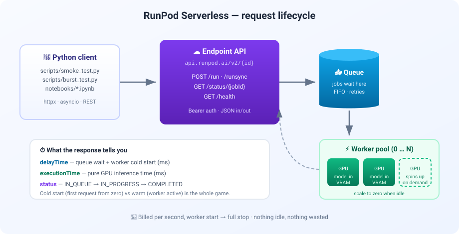

# 🚀 RunPod Serverless GPU Demo


A minimal, reproducible demonstration of **queue-based serverless GPU inference** on
[RunPod Serverless](https://www.runpod.io/product/serverless): how a request flows from a
Python client through the endpoint queue to a GPU worker, what cold starts actually cost,
how the worker pool scales under concurrent load, and what per-second billing looks like
in practice.

## 📖 What this does

RunPod Serverless serves a **pre-trained model behind an HTTP API** — inference, not
training. You deploy a container (a Hub template, or your own handler function), and
RunPod runs it on GPUs only while requests are in flight:

- 🧊 **Cold start measurement** — submit a job to an idle endpoint (`POST /run`), poll
  `GET /status/{jobId}`, and watch `delayTime`: worker provisioning + model load into VRAM.
- 🔥 **Warm request** — the same call via `POST /runsync` against an active worker;
  compare `delayTime` cold vs warm (with FlashBoot enabled, sub-200 ms starts).
- 💥 **Burst load test** — fire N concurrent requests with `asyncio` + `httpx`, record
  per-request `delayTime` / `executionTime` / wall time, and sample `GET /health` once per
  second to watch the worker pool scale.
- 💸 **Cost math** — worker-seconds × GPU hourly rate (or the per-job `cost` field some
  endpoints report in their output) → the actual bill for the session.

### The request lifecycle



## 📁 Project structure

```
runpod-demo/
├── 📄 pyproject.toml / uv.lock        # pinned dependencies (uv-managed)
├── 🔐 .env.example                    # RUNPOD_API_KEY, ENDPOINT_ID, GPU_HOURLY_USD
├── 📜 README.md
├── 📊 docs/
│   └── architecture.svg               # request-lifecycle diagram
├── 🗂️ scripts/
│   ├── create_endpoint.py             # deploy an endpoint via POST /v1/endpoints (REST)
│   ├── smoke_test.py                  # health → cold start → warm request → cost
│   ├── burst_test.py                  # N concurrent requests + /health scaling watch
│   └── build_notebook.py              # regenerates the notebook from source
└── 📓 notebooks/
    └── runpod_serverless_demo.ipynb   # narrated end-to-end walkthrough
```

## ⚙️ Setup

Requires [uv](https://docs.astral.sh/uv/).

```bash
uv sync
cp .env.example .env
```

Fill in `.env`:

| Variable | What |
|---|---|
| `RUNPOD_API_KEY` | Console → **Settings → API Keys → Create** (use a *Restricted* key, scoped to one endpoint) |
| `ENDPOINT_ID` | Your queue-based endpoint, or a Runpod-hosted public model endpoint (e.g. `black-forest-labs-flux-1-schnell`) — the API is identical |
| `GPU_HOURLY_USD` | Hourly rate of your endpoint's GPU tier (used only for cost estimates) |

## ▶️ Usage

```bash
uv run scripts/create_endpoint.py --template-id <HUB_TEMPLATE_ID>   # deploy via API (optional)
uv run scripts/smoke_test.py                    # single-request proof: cold vs warm
uv run scripts/burst_test.py                    # 20 concurrent requests + scaling watch
uv run scripts/burst_test.py --requests 40 --concurrency 20
uv run jupyter notebook                         # open notebooks/runpod_serverless_demo.ipynb
```

## 🔌 API surface used

| Operation | Route | Used for |
|---|---|---|
| Submit async job | `POST /v2/{id}/run` | Cold-start test (polling-friendly) |
| Submit sync job | `POST /v2/{id}/runsync?wait=ms` | Warm requests (blocks up to 300 s) |
| Job status | `GET /v2/{id}/status/{jobId}` | IN_QUEUE → IN_PROGRESS → COMPLETED |
| Endpoint health | `GET /v2/{id}/health` | Live worker/queue counts (own endpoints only) |

Full reference: [RunPod Serverless API docs](https://docs.runpod.io/serverless/endpoints/operation-reference).

## 🧾 Notes

- ⏳ **Cold starts are minutes-scale** on first deploy (container pull + model load) — the
  scripts use `/run` + polling with a 10-minute budget for that reason.
- 🧮 `delayTime` = queue wait + worker start; `executionTime` = pure GPU work. Idle cost
  lives entirely in `delayTime` — drive it to zero and you drive waste to zero.
- 🔓 Public model endpoints don't expose `/health`; your own endpoints do.
- 📓 Edit `scripts/build_notebook.py` (not the `.ipynb` directly) to change the notebook.
